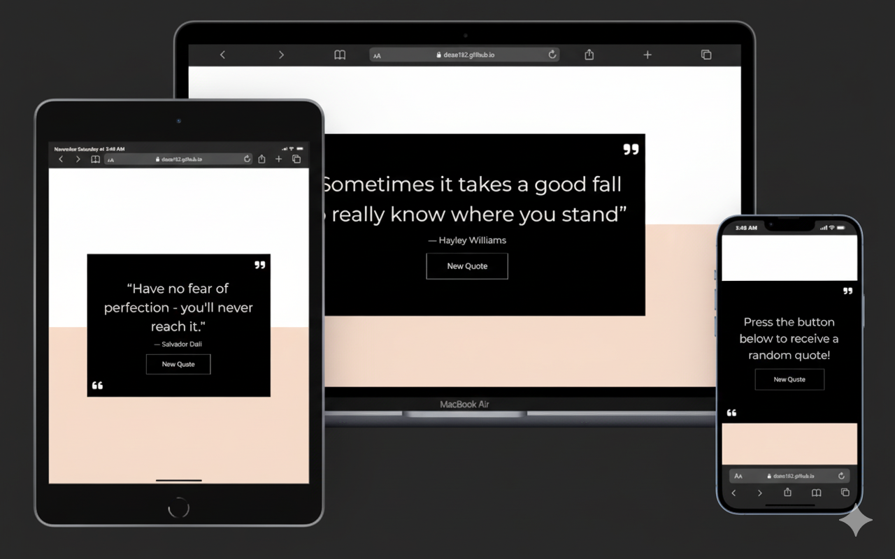

# ✨ Random Quote Generator

A simple, responsive web app that displays motivational quotes at the click of a button — featuring SEO-friendly meta tags for better discoverability and easy theme customization using CSS variables.

---

## 💡 Main JavaScript Logic

1️⃣ Generates a random quote from a predefined list whenever the user clicks the **“New Quote”** button.  
2️⃣ Prevents repetition by storing displayed quotes in an array.  
3️⃣ Once all quotes are shown, the **“New Quote”** button is disabled, and a **Reset** button appears to restart the experience.  
4️⃣ Uses `aria-live="polite"` to ensure accessibility by updating content dynamically without disrupting assistive technologies.

---

## 🛠️ Tech Stack

- **HTML5**  
- **CSS3**  
- **Bootstrap 5**  
- **JavaScript (Conditional statements, Arrays, Functions, Math methods, DOM manipulation, Event handling)**  
- **Google Fonts**  
- **Font Awesome**

---

## 💻 GitHub Repo & Live Demo

🔗 **GitHub Repo:** [Random Quote Generator](https://lnkd.in/dFVkpZr9)  
🌐 **Live Demo:** [View on GitHub Pages](https://lnkd.in/dmamJazH)

---

## 👩‍💻 Author

**Doaa Diaa El Din**  
🔗 [GitHub Profile](https://github.com/Doaa182)

---

## 📸 Screenshot
 
